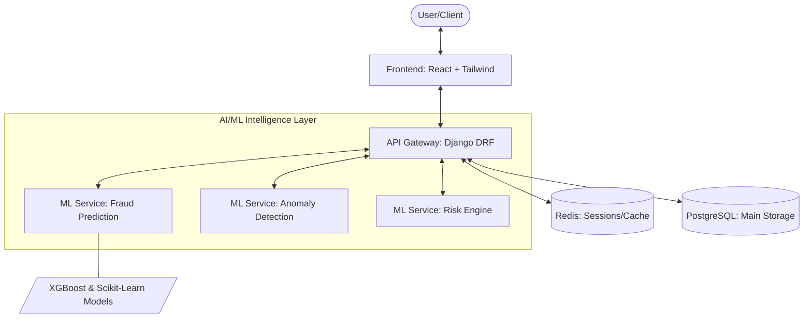

# 🧠 QuantMind: Enterprise-Grade Financial Intelligence & Risk Engine

[](https://www.python.org/)
[](https://www.djangoproject.com/)
[](https://reactjs.org/)
[](https://fastapi.tiangolo.com/)
[](https://www.docker.com/)

QuantMind is a state-of-the-art, production-ready fintech ecosystem designed for real-time fraud detection, sophisticated risk scoring, and deep user behavior analytics. Built with a high-performance microservices architecture, it bridges the gap between raw financial data and actionable intelligence.

---

## 🏛️ Architecture Overview

QuantMind utilizes a decoupled, resilient architecture designed for scalability and low-latency processing.



---

## ✨ Key Features

### 🛡️ Fraud Detection & Prevention
- **Real-time Scoring**: Instant transaction analysis using pre-trained ML models.
- **Rule-based Engine**: Customizable heuristics for immediate flagging of known patterns.
- **Anomaly Detection**: Unsupervised learning to identify novel fraud vectors.

### 📊 Advanced Analytics
- **User Segmentation**: K-Means clustering for identifying high-value vs. high-risk users.
- **Risk Profiles**: Comprehensive 0-100 risk scoring based on historical behavior and velocity.
- **Interactive Dashboards**: Dynamic visualizations using Recharts for transaction trends and risk distribution.

### 🔐 Enterprise Security
- **JWT Orchestration**: Secure, stateless authentication with automated token rotation.
- **RBAC**: Granular Role-Based Access Control (Admin, Analyst, Viewer).
- **Data Integrity**: Full audit trails for all sensitive transaction modifications.

---

## 🚀 Quick Start

### 🐳 The Docker Way (Recommended)

Get the entire ecosystem running in under 5 minutes:

```bash
git clone https://github.com/Ananthapadmanabhan333/Quantmind.git
cd Quantmind
docker-compose up -d
```

| Service | URL |
| :--- | :--- |
| **Frontend Dashboard** | `http://localhost:3000` |
| **API Gateway** | `http://localhost:8000` |
| **ML Intelligence** | `http://localhost:8001` |

### 🛠️ Manual Installation

#### 🐍 Backend & ML Services
```bash
# Setup Backend
cd backend
python -m venv venv
source venv/bin/activate # or venv\Scripts\activate
pip install -r requirements.txt
python manage.py migrate
python manage.py runserver

# Setup ML Service
cd ../ml_service
python -m venv venv
source venv/bin/activate
pip install -r requirements.txt
uvicorn main:app --port 8001
```

#### ⚛️ Frontend
```bash
cd frontend
npm install
npm run dev
```

---

## 🛠️ Tech Stack

| Layer | Technologies |
| :--- | :--- |
| **Frontend** | React 18, Tailwind CSS, Framer Motion, Recharts |
| **Backend** | Django 4.2, Django REST Framework, Celery |
| **ML Engine** | FastAPI, Scikit-Learn, XGBoost, Pandas |
| **Data Store** | PostgreSQL 15, Redis 7 |
| **DevOps** | Docker, Docker Compose, GitHub Actions |

---

## 📜 API Documentation

Detailed API documentation is available at:
- **Swagger UI**: `http://localhost:8000/api/docs/`
- **Redoc**: `http://localhost:8000/api/redoc/`

---

## 🤝 Contributing

We welcome contributions! Please see our [CONTRIBUTING.md](CONTRIBUTING.md) for details on our code of conduct and the process for submitting pull requests.

## 📄 License

This project is licensed under the MIT License - see the [LICENSE](LICENSE) file for details.

---

<p align="center">Built with by <a href="https://github.com/Ananthapadmanabhan333">Ananthapadmanabhan</a></p>